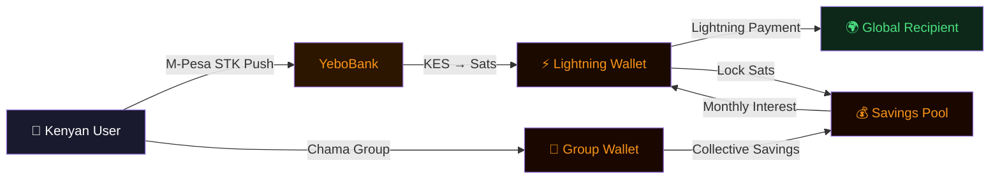

<div align="center">


<br/><br/>

[](https://github.com/altradits/challenges)
[](https://github.com/altradits/yebo)
[](https://github.com/altradits/go-lightning-grpc)
[](#)
[](#)
[](#)

<br/>


[](https://github.com/altradits?tab=followers)

</div>

---

<div align="center">


<br/>


</div>

---

<div align="center">

<a href="https://github.com/altradits">
  
</a>
<a href="https://github.com/altradits">
  
</a>
<a href="https://github.com/altradits">
  
</a>

</div>

---

## Who I Am

Software engineering apprentice at **Zone01 Kisumu, Kenya**. I write Go.

I chose Go because `lightningnetwork/lnd` is 99.5% Go — the most deployed Lightning node in the world. My goal: understand it well enough to merge production code into it. Everything I build is a step toward that.

> **For a Kenyan youth with no credit history, no collateral, and no bank — a Lightning wallet is more powerful than any bank. I am learning the code that makes this possible.**

---

## My Go Journey — 158 Lessons Deep

**[altradits/challenges](https://github.com/altradits/challenges)** — a 158-lesson curriculum designed to take me from `package main` to Bitcoin open source contributor.

```
Phase 1  (01–05)    Hello World       package main · fmt · entry points
Phase 2  (06–27)    Foundations       structs · pointers · interfaces · goroutines
                                      channels · context · testing · file I/O · regexp
Phase 3  (28–51)    Practice          one concept per exercise — building muscle memory
Phase 4  (52–80)    Strings Mastery   every strings / fmt / strconv function
Phase 5  (81–144)   Challenges        hard piscine-style problems, multiple concepts
Phase 6  (145–151)  Backend Bridge    time · JSON · HTTP · SQL · config · logging · generics · graceful shutdown
Phase 7  (152–158)  Capstones         REST APIs → Bitcoin open source contribution
```

<div align="center">

<a href="https://github.com/altradits/challenges">
  
</a>

</div>

---

## Stack Toward LND Contribution

<div align="center">

</div>

<br/>

| Skill | Status | Where I Practice |
|-------|--------|-----------------|
| Go 1.22+ | 🟠 **Active** | [challenges](https://github.com/altradits/challenges) — 158 lessons |
| gRPC + protobuf | 🔵 Learning | [go-lightning-grpc](https://github.com/altradits/go-lightning-grpc) |
| btcsuite/btcd | ⬜ Next | [go-bitcoin-rpc](https://github.com/altradits/go-bitcoin-rpc) |
| macaroon auth | ⬜ Next | [go-lightning-grpc](https://github.com/altradits/go-lightning-grpc) |
| goroutines + context | 🟠 **Active** | challenges 28–152 |
| database/sql | 🟠 **Active** | [go-bursary-api](https://github.com/altradits/go-bursary-api) · [yebo](https://github.com/altradits/yebo) |
| golangci-lint + CI | ⬜ Next | LND itest framework |

**Roadmap to a merged LND PR:**
- [x] Build and deeply understand the full Go language (lessons 01–158)
- [ ] Build `go-lightning-grpc` — speak gRPC to a real LND node
- [ ] Run LND on regtest, write integration tests with the `itest` framework
- [ ] Find a small open issue in `lightningnetwork/lnd`, submit a PR, get it merged

---

## How YeboBank Works



---

## Projects

<!-- flagship -->
<div align="center">
<a href="https://github.com/altradits/yebo">
  
</a>
</div>

<br/>

### ⚡ Bitcoin Infrastructure

<div align="center">
<a href="https://github.com/altradits/go-lightning-grpc">
  
</a>
<a href="https://github.com/altradits/go-bitcoin-rpc">
  
</a>
</div>

### 💰 Financial Access

<div align="center">
<a href="https://github.com/altradits/go-sats-savings">
  
</a>
<a href="https://github.com/altradits/go-bursary-api">
  
</a>
</div>

### 📚 Learning & Community

<div align="center">
<a href="https://github.com/altradits/challenges">
  
</a>
<a href="https://github.com/altradits/bursaryhub">
  
</a>
</div>

---

## Test Your Bitcoin Knowledge

*Click any question to reveal the answer.*

<details>
<summary>⚡ What is the Lightning Network and why does it matter for Africa?</summary>
<br/>

The Lightning Network is a second-layer payment protocol built on Bitcoin. Instead of writing every transaction to the blockchain (slow, expensive), two parties open a **payment channel** — a private ledger between them. Payments settle instantly and for fractions of a cent.

For Africa: M-Pesa charges ~1% per transfer. Lightning charges ~0.001%. A Kenyan sending $10 pays $0.10 on M-Pesa — on Lightning, less than a cent.

</details>

<details>
<summary>₿ How many satoshis are in 1 Bitcoin?</summary>
<br/>

**100,000,000 satoshis** — 1 sat = 0.00000001 BTC.

Named after Satoshi Nakamoto. At $100,000/BTC, 1 satoshi = $0.001. Still useful for micropayments that no other payment system can touch.

</details>

<details>
<summary>🔐 Why does YeboBank have zero external Go dependencies?</summary>
<br/>

Every external dependency is a trust decision — you're trusting that library author's code, their supply chain, and their continued maintenance. In financial software, that trust has a price.

YeboBank uses only Go's standard library. The PostgreSQL wire protocol is implemented from scratch in `internal/pgdrv`. Zero deps means: no supply chain attack surface, no broken upgrades, no abandoned packages in a banking core.

</details>

<details>
<summary>🏦 What is a Chama and why does YeboBank support them?</summary>
<br/>

A **chama** is an informal savings group common across Kenya and East Africa — typically 5–30 people who pool money, invest together, and distribute returns. Chamas manage an estimated **KES 4 billion** across Kenya.

Traditional chamas use M-Pesa with a manual ledger and operate on trust alone. YeboBank gives chamas a transparent group wallet: every contribution, vote, and distribution is verifiable. The group's money is in Bitcoin — it cannot be quietly moved by one member.

</details>

<details>
<summary>🚀 What does it take to contribute to lightningnetwork/lnd?</summary>
<br/>

`lightningnetwork/lnd` is 99.5% Go — 300,000+ lines. Getting a PR merged requires:

1. **Deep Go knowledge** — goroutines, channels, context, interfaces, generics
2. **gRPC fluency** — LND's entire API is protobuf/gRPC
3. **Bitcoin protocol understanding** — scripts, HTLCs, commitment transactions
4. **Test discipline** — every PR needs unit + integration tests via the `itest` framework
5. **Reading existing code** — LND has strict conventions; PRs that ignore them are closed

The [challenges](https://github.com/altradits/challenges) repo is my step-by-step path to earning that merge.

</details>

---

## Open Source

| Contribution | Project | Status |
|-------------|---------|--------|
| Added to contributors list | [btrust-builders/first-open-source-contributions](https://github.com/btrust-builders/first-open-source-contributions) | ✅ Merged — PR #139 |
| Production Go code | [lightningnetwork/lnd](https://github.com/lightningnetwork/lnd) | ⏳ Working toward it |

---

## Why Bitcoin for Africa?

<div align="center">


</div>

<br/>

Three walls Kenyan youth hit:
- **No access to capital** — Lightning changes what collateral means
- **No bank account** — a phone number becomes a bank
- **Bursaries nobody hears about** — [bursaryhub](https://github.com/altradits/bursaryhub) is fixing this

---

<div align="center">

[](https://github.com/altradits)

<br/>

<picture>
  <source media="(prefers-color-scheme: dark)" srcset="https://raw.githubusercontent.com/altradits/altradits/output/github-contribution-grid-snake-dark.svg" />
  <source media="(prefers-color-scheme: light)" srcset="https://raw.githubusercontent.com/altradits/altradits/output/github-contribution-grid-snake.svg" />
  
</picture>

<br/><br/>

**[challenges](https://github.com/altradits/challenges)** · **[yebo](https://github.com/altradits/yebo)** · **[go-lightning-grpc](https://github.com/altradits/go-lightning-grpc)** · **[go-bitcoin-rpc](https://github.com/altradits/go-bitcoin-rpc)** · **[go-sats-savings](https://github.com/altradits/go-sats-savings)**

*Zone01 Kisumu · Kenya · Go + Bitcoin · Building in public*

</div>


