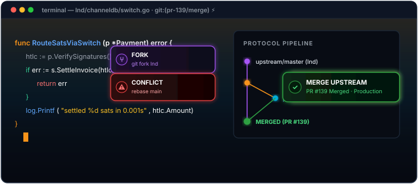
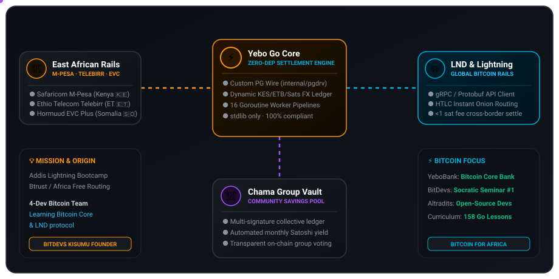

  

 

---

### ⚡ Summary

  

I am a software engineering apprentice at **Zone01 Kisumu, Kenya** and co-founder of **BitDevs Kisumu**, fully dedicated to open-source Bitcoin and Lightning Network protocol development.

My focus is unwavering: deeply master Bitcoin protocols, hunt issues, review PRs, and merge robust production code into critical infrastructure like **`lightningnetwork/lnd`** and payment channel registries while building sovereign financial tools for East Africa.

---

### 🎯 Open-Source Contributions

| Repository | Contribution | Status |
| :--- | :--- | :---: |
| **[minmoto/payment-channels](https://github.com/minmoto/payment-channels)** | [PR #24](https://github.com/minmoto/payment-channels/pull/24): Southern Africa cash channels | `Merged ✅` |
| **[minmoto/payment-channels](https://github.com/minmoto/payment-channels)** | [PR #23](https://github.com/minmoto/payment-channels/pull/23): East Africa cash channels | `Merged ✅` |
| **[minmoto/payment-channels](https://github.com/minmoto/payment-channels)** | [PR #22](https://github.com/minmoto/payment-channels/pull/22): Telebirr ETB channel | `Open ⏳` |
| **[nokia/ntt](https://github.com/nokia/ntt)** | [PR #778](https://github.com/nokia/ntt/pull/778): Windows tests & CI | `Open ⏳` |
| **[jamaljsr/polar](https://github.com/jamaljsr/polar)** | [Issue #1383](https://github.com/jamaljsr/polar/issues/1383): Zero-sat payment bug | `Open ⏳` |
| **[btrust-builders/first-contributions](https://github.com/btrust-builders/first-open-source-contributions)** | [PR #139](https://github.com/btrust-builders/first-open-source-contributions/pull/139), [PR #186](https://github.com/btrust-builders/first-open-source-contributions/pull/186): Contributor registry | `Merged ✅` |
| **[btrust-builders/code-contributions](https://github.com/btrust-builders/open-source-code-contributions)** | [PR #133](https://github.com/btrust-builders/open-source-code-contributions/pull/133): Contributor card | `Merged ✅` |
| **[annanodiyo/chemichemi](https://github.com/annanodiyo/chemichemi)** | [PR #1](https://github.com/annanodiyo/chemichemi/pull/1), [PR #5](https://github.com/annanodiyo/chemichemi/pull/5): IoT telemetry core | `Merged ✅` |

---

### 🚀 Featured Launches & Live Projects

| App / Project | Description | Launch / Status |
| :--- | :--- | :---: |
| 🎮 **Code Royale** | Competitive browser coding battle arena with live in-browser execution & atomic JS puzzles |  |
| ⌨️ **TouchType** | High-speed muscle memory typing battle arena with live arcade telemetry |  |
| ⚡ **YeboBank** | Open-source Bitcoin banking prototype written in pure Go (stdlib only, zero external deps) |  |
| 🎙️ **BitDevs Kisumu** | Western Kenya's Bitcoin developer community — Socratic Seminar #1 on 12 Sep 2026 @ LakeHub |  |
| 📚 **Go Challenges** | 158 structured challenges covering Go concurrency, pointers, channels, and network protocols |  |

---

### 🗺️ The Open-Source Contributor Roadmap

- [x] **Go Foundations**: Master Go memory model, goroutines, channels, and testing (**158 lessons deep**)
- [x] **Addis Ababa Lightning Bootcamp**: Completed intensive Lightning development cohort sponsored by **Btrust Builders**, **Africa Free Routing**, and **HRF**
- [x] **Grassroots Leadership**: Co-founded **BitDevs Kisumu** ([@BitDevsKsm](https://x.com/BitDevsKsm)) and organized Socratic Seminar #1
- [x] **Live Product Delivery**: Shipped interactive apps including **[Code Royale](https://js-mastery-livid.vercel.app/)**, **[TouchType](https://touchtype-72i6.onrender.com/)**, and **[YeboBank](https://github.com/altradits/YeboBank) core**
- [ ] **LND Regtest Environment**: Connect custom Go gRPC clients to local LND regtest clusters
- [ ] **Integration Testing**: Write tests using LND's `itest` framework
- [ ] **Upstream Merge**: Submit PR and merge production code into `lightningnetwork/lnd`

---

### ⚡ East Africa Bitcoin Architecture

  

---

### ⚡ Value for Value · Bitcoin Lightning Wallet

Support open-source Bitcoin protocol development, upstream PR reviews, and grassroots developer education in East Africa.

<table>
<tr>
<td align="center" width="280">
  
   
  ⚡ <b>Scan with any Lightning wallet</b>
</td>
<td valign="middle">

<b>⚡ Lightning Address:</b> 
<code>potablesignal21@walletofsatoshi.com</code>

<b>🔗 Direct LNURL (Tap to open or copy):</b> 

 
<code>lnurl1dp68gurn8ghj7ampd3kx2ar0veekzar0wd5xjtnrdakj7tnhv4kxctttdehhwm30d3h82unvwqhhqmm5v93xcetnd9nkuctvxgcsm55zyn</code>

<i>Works with Phoenix, Wallet of Satoshi, Zeus, Breez, Strike, Cash App, Blink, and all LNURL-pay wallets.</i>

</td>
</tr>
</table>

---

### 🤝 100% In on Bitcoin · Ready to Engage

> *"I am in this fully. My work is focused on mastering Bitcoin & Lightning protocols, shipping audited Go infrastructure, reviewing open-source pull requests, and scaling the Bitcoin developer ecosystem across East Africa."*

I am actively available to collaborate, pair, and build on:
- ⚡ **Bitcoin & Lightning Protocol Development**: Upstream contributions to `lightningnetwork/lnd`, payment channels, and testing frameworks.
- 🔍 **Open-Source PR Reviews & Bug Hunting**: Thorough code reviews, reproducing test failures, and patch verification.
- 🎙️ **BitDevs Kisumu & Socratic Seminars**: Discussion of BIPs, BOLTs, Layer-2 scalability, and technical workshops.
- 🌍 **African Financial Rails**: Dual-rail architecture bridging East African mobile money (M-Pesa, Telebirr) to Bitcoin Lightning.
- 🚀 **FOSS Fellowships & Protocol Grants**: Dedicated full-time protocol contribution and research.

---

### 📊 GitHub Activity & Telemetry

  

 

<picture>
  <source media="(prefers-color-scheme: dark)" srcset="./assets/github-contribution-grid-snake-dark.svg" />
  <source media="(prefers-color-scheme: light)" srcset="./assets/github-contribution-grid-snake.svg" />
  
</picture>

  

 

**Always open to collaborate on Bitcoin open source, code reviews, and developer community building.**

 

**[touchtype](https://touchtype-72i6.onrender.com/)** · **[code-royale](https://js-mastery-livid.vercel.app/)** · **[challenges](https://github.com/altradits/challenges)** · **[YeboBank](https://github.com/altradits/YeboBank)** · **[altradits](https://github.com/altradits/altradits)**

